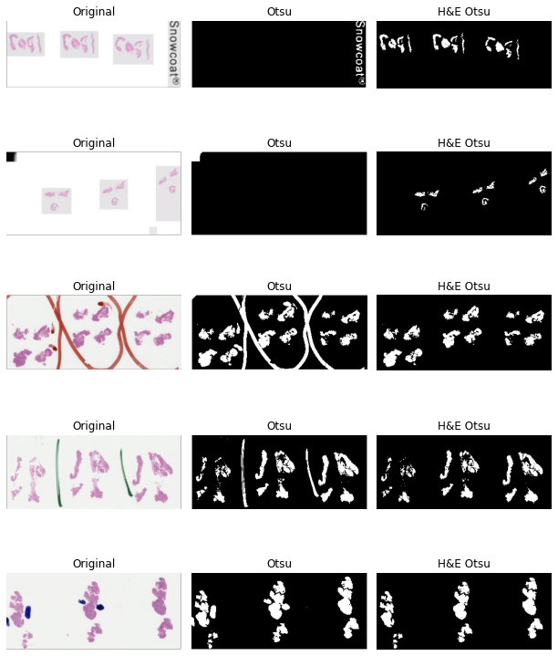

# H&E Otsu Thresholding

## Description

This repo contains code for haematoxylin and eosin (H&E) Otsu thresholding as described in [\[Schreiber et al., 2023\]](#otsu). H&E Otsu thresholding is an improvement on Otsu thresholding for segmenting the tissue in a whole slide image (WSI) of an H&E stained biopsy.

The tissue segmentation tool is built to segment only tissue, and will remove all other features including background, pen marks, and other artefacts.

The performance of H&E Otsu thresholding and standard Otsu thresholding are shown below:



## Installation

To clone and install this repo run:
```bash
git clone git@gitlab.developers.cam.ac.uk:bas43/h_and_e_otsu_thresholding.git
cd h_and_e_otsu_thresholding
conda env create -f requirements.conda.yml
conda activate he_otsu
pip install histolab ipykernel 
python -m ipykernel install --user --name he_otsu --display-name "Python (he_otsu_histo)"
jupyter notebook
```
Then Open your .ipynb file.
At the top, click “Kernel” > “Change Kernel”.
Select “Python (he_otsu)”.

## Authors and acknowledgment

The project was created and is maintained by:

- Ben Schreiber
- Jim Denholm
- Florian Jaekle

Any queries about the repository, please contact us a t bas43@cam.ac.uk

## Target audience

This repository is for anyone who has been granted access to use in computational pathology activities.

## Examples

Examples of how to use this repository can be found in [``demo.ipynb``](demo.ipynb).

## References

1. <a name="otsu"></a> B. A. Schreiber, J. Denholm, F. Jaeckle, M. J. Arends, K. M. Branson, C.-B.Schönlieb, and E. J. Soilleux. Bang and the artefacts are gone! Rapid artefact
removal and tissue segmentation in haematoxylin and eosin stained biopsies, 2023.
URL http://arxiv.org/abs/2308.13304.
